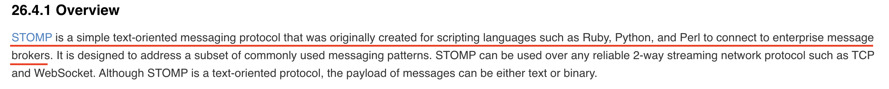
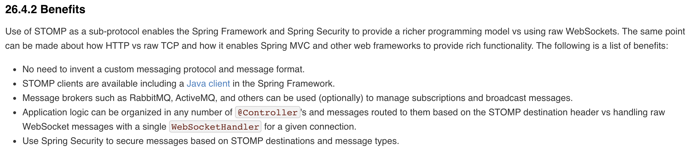

# Websocket example in spring
 ### branch explanation
 1. basic-websocket : websocket basic configuration in spring framework(only websocket not use STOMP)  
&nbsp;&nbsp; : TCP -> Websocket  
&nbsp;&nbsp; : reference) https://docs.spring.io/spring-framework/docs/4.3.x/spring-framework-reference/html/websocket
.html#websocket-server

 2. stomp-websocket : Websocket + STOMP  
&nbsp;&nbsp; : TCP -> Websocket -> STOMP  
&nbsp;&nbsp; : reference) https://docs.spring.io/spring-framework/docs/4.3.x/spring-framework-reference/html
/websocket.html#websocket-stomp  
&nbsp;&nbsp; : features)  
&nbsp;&nbsp;&nbsp;&nbsp; 1. 
&nbsp;&nbsp;&nbsp;&nbsp; 2. 
 3. stomp-websocket-messageBroker : TODO